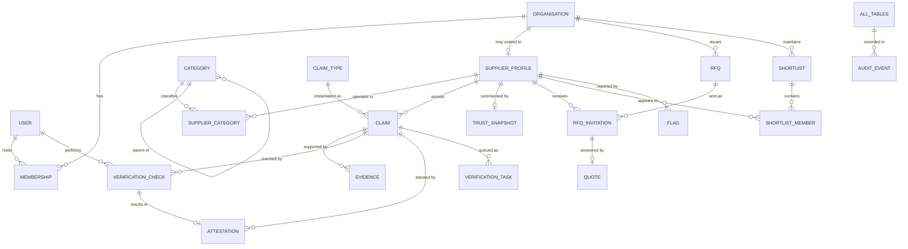
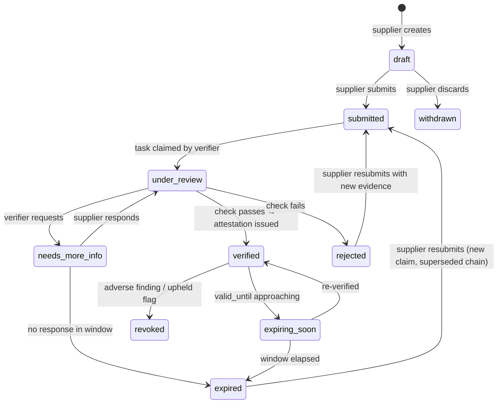
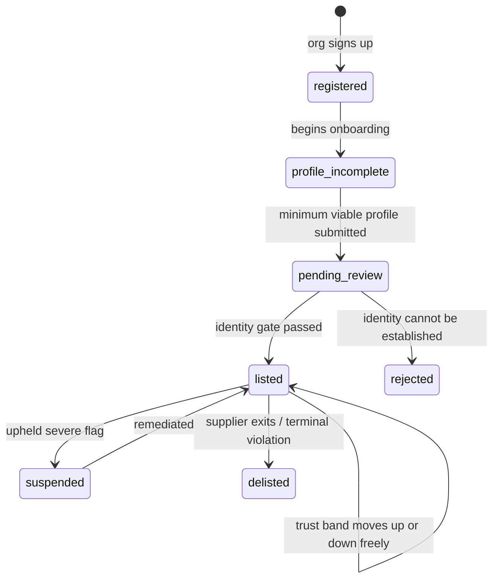
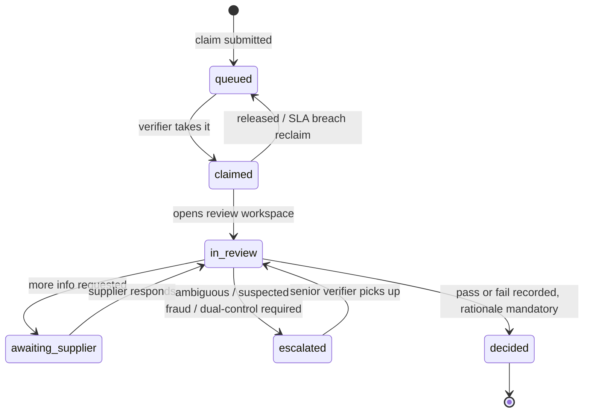

# UNDERSTANDING.md

**Project:** Supplier Discovery & Verification Platform
**Document status:** v0.1 — foundational. Expect revision as open questions in §12 close.
**Scope of this document:** the *why* and the *shape*. Not the *how* of any framework.

---

## 0. How to read this document

This document is deliberately **stack-agnostic**. No framework, library, or vendor is named as a
requirement. That is not vagueness — it is a constraint we imposed on ourselves, for one reason:

> If the architecture cannot be described without naming a framework, then we have not designed
> an architecture. We have merely chosen a framework and let it design the product for us.

Everything here is expressed as **capabilities required** and **invariants that must hold**. Any
competent stack can satisfy them; the stack decision (a separate document) becomes a matter of
picking the tool that satisfies these with the least friction, rather than the tool whose shape we
then contort the product to fit.

Read in order. §1–§2 establish first principles; §3–§5 derive the domain from them; §6–§9 derive
the application from the domain; §10–§12 bound the work.

**Reading order by role**
| If you are... | Read first |
| --- | --- |
| Writing the DB / migrations | §3, §4, §5 |
| Building buyer-facing UI | §1, §2, §6, §7, §8 |
| Building the verifier console | §2, §4, §5, §6.3, §9 |
| Presenting / defending this project | §1, §2, §4, §12 |

---

## 1. The problem, from first principles

### 1.1 Strip it to the root

Do not start from "buyers need a supplier directory." That is a solution wearing the costume of a
problem. Start from the actual economic defect:

> **A buyer cannot cheaply observe whether a supplier is what they claim to be.**

Committing a purchase order transfers real capital against a set of unverifiable assertions: that
the entity legally exists and is in good standing, that the factory exists, that the stated capacity
is real, that the quality certification is current, that the goods will actually arrive.

Verifying those assertions independently is expensive — registry lookups, document collection,
reference calls, site visits. So most buyers don't. They price the uncertainty in instead.

This is a textbook **information asymmetry** problem, and it has a known failure mode
(Akerlof's *market for lemons*):

1. Buyers cannot distinguish good suppliers from bad ones.
2. So buyers rationally discount **every** supplier by the expected cost of being wrong.
3. Good suppliers, who cannot capture a premium for quality they cannot prove, exit or stop
   competing on quality.
4. Average market quality falls. Buyer distrust becomes *more* rational. Repeat.

The platform's reason to exist, stated precisely:

> **To make supplier quality signals credible and cheap to observe — converting private,
> unverifiable claims into public, evidenced ones.**

### 1.2 The razor this gives us

Because the purpose is that sharply defined, we get a scope-control test. Call it the
**Asymmetry Razor**:

> Every feature must measurably reduce either
> **(a)** the buyer's cost of *finding* candidate suppliers, or
> **(b)** the buyer's cost of *trusting* a candidate supplier.
>
> A feature that does neither is not a feature. It is scope creep with good PR.

This is not decoration. Applied honestly, this razor is what stops a capstone project from
metastasising into a half-built social network with a chat feature and a notifications bell nobody
needed. When a feature is proposed, we name which arm of the razor it satisfies, or we cut it.

### 1.3 Two problems, not one

"Discovery and verification" is a compound name, and the two halves are genuinely different
engineering problems. Conflating them is the most common way platforms in this space go wrong.

| | **Discovery** | **Verification** |
| --- | --- | --- |
| Question answered | Who *could* supply this? | Can I *trust* this one? |
| Nature of the problem | Information retrieval, ranking | Evidence gathering, attestation |
| Cardinality | one query → many candidates | one supplier → deep, narrow |
| Latency budget | milliseconds; interactive | hours to days; asynchronous |
| Interaction model | request → response | submit → wait → outcome |
| Dominant failure | **missed** candidates (recall) | **false trust** (precision) |
| Cost of that failure | buyer sees fewer options | buyer loses money; platform loses credibility |
| Therefore optimise for | recall, then precision | precision, always |

That last row is the important one. The two halves have **asymmetric failure costs**. A supplier
missing from search results is a mild inefficiency. A supplier falsely presented as verified is a
direct financial harm to a buyer and an existential credibility loss for the platform. One bad
verification is worth more than a thousand missed search hits.

**Consequences we accept from this:**

- Verification is **conservative by default**. Uncertainty resolves to *unverified*, never to *fine*.
- There is **no neutral state in the UI**. A blank field, a missing badge, an empty section — a buyer
  will read any of these as tacit approval. Every claim renders either as evidenced, or as
  explicitly *not* evidenced. Silence is not permitted to look like assent.
- Discovery may be fuzzy, forgiving, and generous. Verification may not.

### 1.4 What failure looks like

Naming the failure modes up front, because each one directly produces a design rule later.

| Failure mode | What it looks like | Where we address it |
| --- | --- | --- |
| **The magic number** | Opaque "Trust Score: 87%" that nobody can explain, justify, or dispute | §2 A1, §4.4 |
| **Verified-forever** | A 2019 certificate still rendering a green tick in 2026 | §2 A3, §4.3 |
| **Self-certification laundering** | Supplier types "ISO 9001" into a text field; UI shows a quality badge | §2 A2, §2 A6 |
| **Directory rot** | Stale listings, dead contacts, no freshness signal → buyers stop trusting the corpus | §4.3, §5.1 |
| **Trust theatre** | Badges and shields everywhere, no evidence behind any of them | §2 A1, §7.1 |
| **The blank profile problem** | Unverified supplier looks identical to a not-yet-checked one | §1.3, §2 A4 |
| **Score gaming** | Supplier stacks cheap self-declared claims to climb the ranking | §4.5 |
| **Onboarding cliff** | Supplier abandons a 40-field form at field 12; supply side never fills | §6.2, §8.3 |

---

## 2. Design axioms

These are the constitution. Everything downstream is derived from them, and any proposed change
that violates one must either be rejected or must explicitly amend the axiom.

---

**A1 — Trust is decomposable. There are no opaque scores.**

Every aggregate figure must be drillable, in the UI, to the individual claims composing it — and
each claim to its evidence, its verification method, its timestamp, and its attestor.

*Test:* if a number cannot be explained to the supplier it describes and the buyer reading it,
it does not get rendered. Explainability is a precondition of display, not a nice-to-have.

---

**A2 — Evidence has strength, and strength is ordered.**

```
self-declared  <  document provided  <  third-party checked  <  human audited  <  site verified
```

The UI must always render *how* something was established, never merely *that* it was. "Verified"
alone is a lie of omission; "Verified — GST registry, 4 days ago" is information.

---

**A3 — Trust decays. Verified is not a permanent state.**

Every attestation carries a validity window. Certificates lapse; registrations are cancelled;
a capacity claim from three years ago describes a different factory. Expiry and re-verification
are **first-class domain concepts modelled in the schema** — not a nightly cleanup job bolted on later.

*Corollary:* a supplier's trust standing can fall without the supplier doing anything at all.
The system must communicate this before it happens, not after.

---

**A4 — Absence of evidence is not evidence of absence — and it is never evidence of adequacy.**

Unknown is a distinct, rendered, first-class state. Distinct from *verified*, distinct from
*rejected*, and never silently collapsed into either.

---

**A5 — The verification ledger is append-only.**

A verification decision is never edited in place. A reversal is a **new record superseding** the old.
This buys us three things for the price of one: a complete audit trail as a free side effect,
tractable dispute resolution ("what did we know, and when?"), and the ability to re-run a scoring
model change over history without having destroyed the inputs.

---

**A6 — Rigid separation of *claim* and *attestation*.**

The **supplier asserts**. The **platform attests**. These are different records, with different
authors, different tables, and different write permissions.

A supplier can never, by any code path, write to their own verification state. This is the single
most important integrity boundary in the system. If it leaks, nothing else in this document matters.

---

**A7 — Search is trust-aware, but trust is not search.**

Ranking blends relevance and trust. The buyer controls the blend and can see that it is being
applied. We never silently bury a highly relevant unverified supplier, and never silently promote
an irrelevant verified one. Ranking that cannot be inspected is indistinguishable from ranking
that has been sold.

---

**A8 — Three consoles, one ledger.**

Buyer, supplier, and verifier interfaces are role-scoped **projections over a single source of
truth**. They are not three products with three databases that reconcile. Divergent truth is the
failure we are specifically engineering against.

---

**A9 — Every asynchronous process is visible.**

Verification takes hours or days. At any moment, every actor can see: what is pending, why it is
pending, who holds it, what happens next, and by when. No silent queues. No black holes. A user
who cannot see progress assumes failure and abandons.

---

**A10 — Claim types are data, not code.**

The catalogue of verifiable attributes lives in a **registry table**, not in `if/else` branches
across the codebase. Supporting a new certification, a new jurisdiction's registration number, or
a new capability dimension must be a data change plus (optionally) one renderer — never a
rebuild of the verification pages.

This is what makes the system extensible past the demo, and it is the axiom most likely to be
quietly violated under deadline pressure. Guard it.

---

## 3. The domain model

### 3.1 The central modelling decision

Everything hinges on one choice, and getting it right early is the difference between a system that
extends gracefully and one that has to be rewritten in month three.

**The naive model** — the one almost everyone reaches for first:

```
supplier
  ├─ is_gst_verified      BOOLEAN
  ├─ has_iso_9001         BOOLEAN
  ├─ trust_score          INTEGER
  └─ verified_at          TIMESTAMP
```

This is fatally wrong, and it is worth being precise about *why*, because the reasons map one-to-one
onto our axioms:

- A boolean cannot express *how* something was verified → violates **A2**.
- A boolean cannot express *when*, or *until when* → violates **A3**.
- A boolean cannot carry its evidence → violates **A1**.
- `trust_score` as a stored, hand-set column is unexplainable and unreproducible → violates **A1**.
- Adding a certification requires a schema migration + UI change → violates **A10**.
- Nothing structurally prevents the supplier's own write path from setting `is_gst_verified`
  → violates **A6**.
- Overwriting `verified_at` destroys history → violates **A5**.

Six axioms broken by four columns. That is a good demonstration of why the axioms come first.

**The correct model** is a **claim ledger**. A supplier is not a bag of verified attributes. A
supplier is an **entity about which claims are asserted, evidence is attached, checks are performed,
and time-bounded attestations are issued.**

The unit of the system is not the supplier. It is the **claim**.

### 3.2 The four-layer spine

```
   CLAIM              — what the supplier asserts          (authored by supplier)
     │                  "our GSTIN is 27AAECS1234F1Z5"
     ▼
   EVIDENCE           — artefacts offered in support       (authored by supplier)
     │                  the certificate PDF, a photo, a registry response
     ▼
   VERIFICATION_CHECK — a single act of checking            (authored by platform / verifier)
     │                  immutable event. "registry API returned ACTIVE, 12 Jul, adapter v1"
     ▼
   ATTESTATION        — the platform's standing position    (authored by platform)
                        time-bounded, supersedable. "verified via third-party, valid to 10 Oct"
```

Read top to bottom, the write authority flips exactly once — between EVIDENCE and
VERIFICATION_CHECK. That boundary *is* axiom **A6**, expressed as a schema property rather than as
a code convention. Convention drifts; schema does not.

Why both `verification_check` and `attestation`, when they look redundant?

- `verification_check` is an **event**: something happened at a point in time, with an outcome.
  Append-only. Never mutated. This is the audit log (**A5**).
- `attestation` is a **standing state**: the platform's current position, with a validity window.
  Also append-only — superseded rather than updated.

Event log plus current-state projection. Lightweight event sourcing, and it is what makes "replay
history under a corrected scoring model" possible instead of aspirational.

### 3.3 Entity–relationship overview



### 3.4 Why relational

A decision worth justifying rather than defaulting into.

The domain is **irreducibly relational**: claim → evidence → check → attestation is a chain we must
traverse in both directions, constantly. Faceted search needs multi-way joins over categories,
capabilities, geography and trust state simultaneously. Attestation issuance must be transactional
(a check and the attestation it produces either both land or neither does). Append-only integrity
wants foreign keys and constraints, not application-layer discipline.

A document store would let us nest evidence inside claims inside suppliers — which reads nicely for
the *profile* view and falls apart for every other access pattern, particularly the verifier queue
(which slices across suppliers by claim state) and search.

**Therefore:** a normalised relational core as the single source of truth, plus **one denormalised
read projection** for search (§3.9). The projection is disposable and rebuildable from the core.
The core is never derived from the projection.

### 3.5 Identity and organisations

An important early decision: **buyer and supplier are roles, not types.** A manufacturing firm
sources raw materials *and* sells finished goods. Modelling `buyers` and `suppliers` as separate
root tables duplicates identity and guarantees a painful reconciliation later.

So: `organisation` is the root identity. `supplier_profile` is an *optional extension* an
organisation acquires when it chooses to sell.

```sql
organisation
  id                  uuid pk
  legal_name          text not null
  trade_name          text
  entity_type         enum(proprietorship, partnership, pvt_ltd, public_ltd, llp, huf, coop, other)
  country_code        char(2) not null
  registered_address  jsonb
  year_established    smallint
  website             text
  status              enum(active, suspended, closed) not null default 'active'
  created_at, updated_at

user
  id                  uuid pk
  email               citext unique not null
  full_name           text
  phone               text
  platform_role       enum(none, verifier, senior_verifier, platform_admin) default 'none'
  status              enum(invited, active, disabled)
  created_at, last_seen_at

membership                              -- user ↔ organisation, many-to-many
  user_id             uuid fk → user
  organisation_id     uuid fk → organisation
  org_role            enum(owner, admin, member, viewer) not null
  created_at
  primary key (user_id, organisation_id)
```

Note `platform_role` sits on `user`, not on `membership`: a verifier acts on behalf of the platform,
not on behalf of any organisation. Keeping these on separate axes prevents the ugly case of a
supplier's own admin inheriting verification powers over their own claims — **A6** again, defended
structurally.

### 3.6 Supplier profile and taxonomy

```sql
supplier_profile
  organisation_id     uuid pk fk → organisation
  headline            text                    -- one-line positioning
  description         text
  operational_sites   jsonb                   -- [{type: factory|warehouse|office, address, area_sqft}]
  employee_band       enum(1_10, 11_50, 51_200, 201_500, 500_plus)
  turnover_band       enum(...)               -- band, not exact figure; see §10.4
  export_markets      text[]                  -- ISO country codes
  languages           text[]
  logo_ref            text
  listing_state       enum(draft, pending_review, listed, suspended, delisted)
  completeness        smallint                -- 0..100, derived, cached
  created_at, updated_at

category                                       -- tree
  id                  uuid pk
  parent_id           uuid fk → category null
  slug                text unique
  name                text
  external_codes      jsonb    -- {nic: '...', unspsc: '...', hs: '...'} — see §12 Q3
  depth               smallint
  path                ltree / text             -- materialised path for subtree queries

category_alias                                 -- search recall: synonyms, regional terms,
  category_id         uuid fk → category       -- misspellings, trade names
  alias               text
  locale              text

supplier_category
  organisation_id     uuid fk → supplier_profile
  category_id         uuid fk → category
  is_primary          boolean
  capacity_value      numeric                  -- per-category, because capacity is not global
  capacity_uom        text
  moq                 numeric
  lead_time_days      smallint
  primary key (organisation_id, category_id)
```

Two things worth flagging.

**Capacity, MOQ and lead time live on `supplier_category`, not on `supplier_profile`.** A supplier
does not have "a capacity" — they have a capacity *per product line*. Hoisting it to the profile is
a lossy simplification that makes filtered search subtly wrong ("capacity ≥ 10,000" matching a
supplier whose 10,000 units are in a category the buyer isn't shopping).

**`category_alias` is not padding.** Discovery is a recall problem (§1.3). Buyers search in trade
vernacular, regional language, and typos. Without an alias layer, the corpus is only reachable by
people who already know its internal vocabulary — which defeats the purpose.

### 3.7 The claim ledger — core tables

```sql
claim_type                              -- THE REGISTRY. Axiom A10 lives here.
  key                 text pk           -- 'gst_registration', 'iso_9001', 'annual_capacity'
  label               text
  description         text              -- shown to supplier: what this is, why it matters
  pillar              enum(identity, legal, financial, quality, capability, compliance, reputation)
  value_schema        jsonb             -- JSON Schema for claim.value; drives form + validation
  accepted_evidence   text[]            -- ['certificate_pdf','registry_response']
  max_method          enum(...)         -- ceiling: some claims can NEVER exceed self_declared
  default_validity    interval          -- null ⇒ evidence carries its own expiry
  weight              numeric           -- contribution within its pillar
  applies_when        jsonb             -- {country: ['IN'], entity_type: [...], category: [...]}
  is_active           boolean
  sort_order          smallint

claim                                   -- the supplier's ASSERTION. Supplier-authored.
  id                  uuid pk
  organisation_id     uuid fk → supplier_profile
  claim_type_key      text fk → claim_type
  value               jsonb not null    -- validated against claim_type.value_schema
  state               enum(draft, submitted, under_review, needs_more_info,
                           verified, rejected, expired, withdrawn)
  asserted_by         uuid fk → user
  asserted_at         timestamptz
  superseded_by       uuid fk → claim null    -- resubmission chain, never overwrite
  unique (organisation_id, claim_type_key) where superseded_by is null

evidence                                -- artefacts. Supplier-authored (or verifier-attached).
  id                  uuid pk
  claim_id            uuid fk → claim
  kind                enum(document, photo, registry_response, audit_report, reference_contact)
  storage_ref         text not null     -- object storage key; never a public URL — §10.4
  mime_type           text
  size_bytes          bigint
  checksum_sha256     char(64)          -- see §4.5, duplicate-evidence fraud detection
  issued_on           date              -- date ON the document
  expires_on          date              -- expiry ON the document — drives A3
  extracted           jsonb             -- parsed/OCR fields, later phase
  contains_pii        boolean default false
  uploaded_by         uuid fk → user
  uploaded_at         timestamptz

verification_check                      -- IMMUTABLE EVENT. Platform-authored. A5.
  id                  uuid pk
  claim_id            uuid fk → claim
  method              enum(self_declared, document_review, third_party_api,
                           human_audit, site_visit)
  outcome             enum(pass, fail, inconclusive, needs_more_info)
  confidence          numeric           -- 0..1, for automated checks
  performed_by_user   uuid fk → user null       -- exactly one of these two is non-null
  performed_by_agent  text null                 -- 'gst_adapter@v1'
  performed_at        timestamptz not null
  rationale           text              -- MANDATORY for human decisions — §6.3
  raw_response_ref    text              -- stored adapter payload, for reproducibility
  supersedes_check_id uuid fk → verification_check null
  -- no updated_at. This table is never updated. Enforce with a trigger.

attestation                             -- platform's STANDING POSITION. Append-only.
  id                  uuid pk
  claim_id            uuid fk → claim
  source_check_id     uuid fk → verification_check
  method_achieved     enum(...)         -- highest method that passed
  verified_at         timestamptz not null
  valid_until         timestamptz       -- null ⇒ does not expire (rare; justify each case)
  state               enum(active, expired, revoked, superseded)
  revocation_reason   text
  issued_by           uuid fk → user null
  superseded_by       uuid fk → attestation null
```

The `unique (organisation_id, claim_type_key) where superseded_by is null` partial index is doing
quiet, important work: exactly one *live* claim per type per supplier, with the full resubmission
history preserved behind it. Correctness and history, no trade-off.

### 3.8 Verification workflow tables

```sql
verification_task                       -- drives the verifier queue. §6.3
  id                  uuid pk
  claim_id            uuid fk → claim
  state               enum(queued, claimed, in_review, awaiting_supplier, decided, escalated)
  assigned_to         uuid fk → user null
  priority            smallint          -- derived: claim weight × supplier tier × age
  requires_dual       boolean           -- four-eyes for high-weight claims. §6.3
  sla_due_at          timestamptz
  claimed_at, decided_at
  created_at

flag                                    -- buyer-reported concerns; closes the loop
  id                  uuid pk
  organisation_id     uuid fk → supplier_profile
  raised_by_org       uuid fk → organisation
  claim_id            uuid fk → claim null     -- may target a specific claim
  reason              enum(identity_mismatch, unreachable, misrepresented_capability,
                           document_forgery, non_delivery, other)
  narrative           text
  state               enum(open, investigating, upheld, dismissed)
  created_at, resolved_at

audit_event                             -- immutable. Everything consequential lands here.
  id                  bigserial pk
  actor_user_id       uuid null
  actor_agent         text null
  action              text not null     -- 'attestation.revoked', 'claim.submitted'
  subject_type        text not null
  subject_id          uuid not null
  before, after       jsonb
  occurred_at         timestamptz not null default now()
  request_id          text              -- correlate across the stack
```

### 3.9 Derived / projection tables

Explicitly marked as **caches**. Truth lives in §3.7. These are rebuildable, and if they ever
disagree with the ledger, the ledger wins and the projection is regenerated.

```sql
trust_snapshot                          -- recomputed; never hand-edited. §4
  organisation_id     uuid pk fk → supplier_profile
  band                enum(unverified, basic, verified, audited)
  overall             numeric           -- 0..1
  pillar_scores       jsonb             -- {identity: 0.9, quality: 0.4, ...}
  gates_applied       text[]            -- which caps fired, for explainability
  claim_summary       jsonb             -- counts by state, for fast card rendering
  next_expiry_at      timestamptz       -- drives proactive nudges — A3
  model_version       text not null     -- §4.6
  computed_at         timestamptz
  inputs_fingerprint  text              -- detect staleness cheaply

supplier_search_doc                     -- flattened for retrieval
  organisation_id     uuid pk
  text_blob           tsvector          -- name + aliases + description + categories + capabilities
  category_ids        uuid[]
  country, region     text
  trust_band          enum(...)
  trust_overall       numeric
  capacity_max        numeric
  updated_at
```

### 3.10 Commercial layer (later phase, modelled now)

Not P0, but the schema is sketched so the trust model has somewhere to grow reputation into (§4.7),
and so we don't paint ourselves into a corner.

```sql
rfq
  id, buyer_org_id, title, category_id, spec jsonb, quantity, uom,
  delivery_location jsonb, needed_by date, budget_band,
  state enum(draft, published, receiving, shortlisting, awarded, cancelled, expired),
  visibility enum(invited_only, open_to_verified, open), published_at, closes_at

rfq_invitation
  rfq_id, supplier_org_id, state enum(invited, viewed, quoted, declined, withdrawn),
  invited_at, viewed_at, primary key (rfq_id, supplier_org_id)

quote
  id, rfq_id, supplier_org_id, unit_price, currency, total_price,
  lead_time_days, valid_until, incoterms, terms text, attachments jsonb,
  state enum(submitted, withdrawn, shortlisted, rejected, accepted), submitted_at

shortlist / shortlist_member             -- buyer's working set; drives comparison (§7.1)
  id, buyer_org_id, name, created_by, created_at
  shortlist_id, organisation_id, note, added_at, position
```

`rfq.visibility = open_to_verified` is worth noticing — it is the point where the trust model stops
being a display concern and starts having commercial consequences. That is the moment verification
acquires real value for the supplier, which is what makes them do the work.

---

## 4. The trust model

### 4.1 What we are computing, and what we refuse to compute

**We compute:** *how much of what matters about this supplier has been established, by what strength
of evidence, how recently.*

**We refuse to compute:** whether this supplier is *good*. That is the buyer's judgement, over their
own requirements, and pretending otherwise would be both dishonest and — for a platform — a
liability. We measure **evidential coverage**, not merit.

This distinction is not pedantry. It determines what the number means, what it can be criticised
for, and what we can defend. "Verified" is a statement about *our knowledge*, not about the
supplier's quality.

### 4.2 Per-claim strength

For a claim `c` with an active attestation:

```
  achieved(c) = weight(c) × method_multiplier(m) × freshness(c)
```

```
  achievable(c) = weight(c) × method_multiplier(max_method(c))
```

`achievable` uses the claim type's **ceiling**, not the global maximum — because some claims can
never be independently verified. "We are responsive to communication" tops out at self-declared,
and a supplier must not be penalised in the denominator for a limit inherent to the claim.

Illustrative multipliers (to be tuned; the *shape* is the commitment, not the digits):

| Method | Multiplier | Rationale |
| --- | --- | --- |
| `self_declared` | 0.15 | Non-zero: stating something checkable invites falsification. Barely more than nothing. |
| `document_review` | 0.55 | A human saw a document. Documents can be forged. |
| `third_party_api` | 0.85 | An independent authoritative source agreed. Strong, but narrow in what it covers. |
| `human_audit` | 0.95 | Trained reviewer examined the full picture. |
| `site_visit` | 1.00 | Physical confirmation. Ceiling. |

### 4.3 Freshness and decay (axiom A3, made concrete)

```
             ┌ 1.0                                    if age ≤ fresh_period
 freshness = │ linear ramp 1.0 → 0.0 across the        if fresh_period < age < valid_until
             │   remaining window
             └ 0.0                                     if age ≥ valid_until
```

We choose **piecewise linear** decay over exponential. Exponential is arguably a better model of
how confidence actually erodes. We reject it anyway, for an explicit reason:

> **Explainability outranks mathematical elegance.** Linear decay can be explained to a supplier in
> one sentence — *"your ISO certificate expires in March; from January your quality score starts
> reducing toward zero on that date."* An exponential half-life cannot, and a supplier who does not
> understand why their standing fell will not act to fix it. A model nobody acts on has no effect.

This is a real trade-off, consciously made, and it is the kind of decision worth being able to
defend out loud. (**A1** is upstream of §4 entirely: if the maths cannot be explained, the maths is
wrong for this system regardless of its fidelity.)

Where `valid_until` comes from, in priority order:
1. `evidence.expires_on` — the expiry printed on the artefact itself. Always wins.
2. `claim_type.default_validity` — for checks whose result is a point-in-time status
   (a registry "active" lookup is stale in 90 days regardless of the document).
3. `null` — non-expiring. Rare, and each case must be justified in review. Incorporation date
   does not change; capacity does.

### 4.4 Pillars, aggregation, and gates

```
  pillar_score(P) = Σ achieved(c) over c ∈ P   /   Σ achievable(c) over c ∈ P
```

A **coverage ratio**, bounded [0,1], where the denominator is *everything applicable to this
supplier* — not just what they submitted. A supplier who declares nothing scores 0, not undefined.
This is **A4** expressed as arithmetic: silence is not neutral.

```
  overall_raw = Σ pillar_weight(P) × pillar_score(P)   /   Σ pillar_weight(P)
```

Then **gates**, which are where the model gets its integrity:

| Gate | Condition | Effect |
| --- | --- | --- |
| Identity gate | `pillar_score(identity) < 0.6` | `overall ≤ 0.40`, band ≤ `basic` |
| Legal-standing gate | any `legal` claim actively `rejected` or `revoked` | band ≤ `basic`, prominent notice |
| Flag gate | an upheld `flag` within 180 days | band ≤ `verified`, disclosed on profile |
| Staleness gate | no check of any kind within 12 months | band ≤ `basic` |

Gates are **caps, not subtractions**, and the reason is conceptual: identity is a *prerequisite*,
not a contributor. If we don't reliably know who an entity is, no volume of quality documentation
should let them present as highly trusted — because we cannot even confirm the documents belong to
them. Additive weighting would let soft claims outvote missing identity. Gating makes that
structurally impossible.

`trust_snapshot.gates_applied` records which caps fired, so the UI can say *why* a supplier is
capped rather than showing an unexplained ceiling — **A1**.

### 4.5 Resistance to gaming

An adversarial supplier's dominant strategy is to maximise apparent trust at minimum cost. Each
countermeasure below closes a specific, concrete attack.

| Attack | Countermeasure |
| --- | --- |
| Stack many cheap self-declared claims | Coverage-ratio denominator (§4.4) means unverified claims *add to the denominator too* — declaring more without evidence **lowers** the score. The naive additive model rewards this attack; ours punishes it. |
| Claim your own verification | **A6**, enforced at the schema level: no supplier-writable path reaches `attestation` or `verification_check`. |
| Reuse one genuine document across many accounts | `evidence.checksum_sha256` — an identical artefact appearing under unrelated organisations is a hard fraud signal, auto-escalated. |
| Register the same real entity as several suppliers | Uniqueness + fuzzy match on verified identity values (GSTIN, PAN, CIN) across organisations. |
| Resubmit repeatedly until a lenient reviewer passes it | Resubmission rate limits; the `superseded_by` chain makes prior rejections visible to the next reviewer — history is not erasable. |
| Score-gaming toward the top band | Bands require **method achieved**, not just score (§4.6). `audited` is unreachable without a real audit, at any score. |
| Verify once, then let everything lapse | Decay (§4.3) plus the staleness gate. |

Note the shape of the first row: it is not a bolt-on defence. The *choice of a ratio over a sum* is
itself the countermeasure. Good models make attacks structurally unprofitable rather than
individually blocked.

**On publishing the weights.** We publish the *structure* — the pillars, the method ladder, what
each claim needs, what is currently missing — but not the exact coefficients. This is not in tension
with **A1**: explainability means a supplier can see *precisely which claim needs which evidence to
improve*, which is fully actionable. It does not require handing an adversary an optimisation
target.

### 4.6 Bands

Buyers do not reason well about `0.73`. They reason about categories. The number exists for ranking
and drill-down; the **band** is the primary display object.

| Band | Requires |
| --- | --- |
| **Unverified** | Identity not established. Listed, clearly labelled, not hidden. |
| **Basic** | Identity gate passed. Registration confirmed. Little else established. |
| **Verified** | `overall ≥ 0.45`, identity gate passed, ≥1 active `third_party_api` attestation. |
| **Audited** | `overall ≥ 0.75` **and** an active `human_audit` or `site_visit` attestation. |

The conjunction in the top two rows is deliberate: a band is never purely a function of score.
Method floors make the highest bands unreachable by accumulation alone.

**Unverified suppliers are listed, not hidden.** Hiding them starves the corpus and pushes buyers
back to WhatsApp and word of mouth — which loses us the very asymmetry problem we exist to solve
(§1.1). Honest labelling beats exclusion. **A4** in product form.

### 4.7 Reputation — deliberately deferred

Reputation is the strongest trust signal in existence and also the easiest to fake. The only
defensible version is **outcome-derived**: a review is only admissible where the platform holds
evidence of a real transaction (RFQ → quote → award → delivery confirmation).

Since the commercial layer is a later phase (§3.10), the `reputation` pillar exists in the schema
with weight `0` at launch. We ship an empty pillar rather than a fake one. Anything else would be
trust theatre (§1.4) — the exact failure we named.

### 4.8 Computation rules

1. **Never computed client-side.** A score computed in the browser is a score a supplier can read,
   reverse-engineer, and eventually forge in transit. Server computes; client renders.
2. **Versioned.** `model_version` is stored on every snapshot. Changing weights does not silently
   rewrite history.
3. **Reproducible.** Because the ledger is append-only (**A5**), any historical snapshot can be
   recomputed from its inputs. "Why was this supplier Verified in March?" is an answerable question.
4. **Recomputed on:** new attestation, attestation expiry or revocation, claim state change, upheld
   flag, applicability change (new category → new applicable claim types → new denominator), and
   scheduled sweep for time-based decay.
5. **The snapshot is a cache.** Search may read it. The profile page drill-down reads the ledger.

---

## 5. Lifecycles

State machines, not status strings. Each transition names its actor — which is how we keep **A6**
from eroding one convenient shortcut at a time.

### 5.1 Claim lifecycle



`expiring_soon` is not a stored state — it is `verified` within the notification window. Modelled
here because it is a distinct *UI* state and a distinct *notification trigger*, and pretending
otherwise is how expiry becomes a surprise instead of a prompt (**A3**, **A9**).

### 5.2 Supplier listing lifecycle



The self-transition on `listed` is the point: **listing and trust are orthogonal axes.** Gating
listing on full verification would strangle supply-side liquidity, and the platform with it. We list
early and label honestly — the discovery half of the razor (§1.2) is served by having suppliers to
discover; the verification half is served by labelling, not by exclusion.

### 5.3 Verification task lifecycle



`claimed → queued` matters operationally: a task held by an absent reviewer must return to the pool
automatically. Otherwise the queue silently develops dead zones — an **A9** violation that only
shows up under real load.

---

## 6. Actors, jobs, and the three consoles

Three consoles, one ledger (**A8**). They differ not cosmetically but in **interaction model** —
which is the real reason they cannot be one interface with a role flag.

| | Buyer | Supplier | Verifier |
| --- | --- | --- | --- |
| Dominant operation | read | write | decide |
| Session shape | exploratory, branching | linear, resumable, returns over weeks | repetitive, high-volume |
| Success metric | time-to-confident-shortlist | onboarding completion rate | throughput × accuracy |
| Optimise for | scanning density | friction removal | keystrokes per decision |
| Cost of an error | wasted evaluation time | abandoned onboarding | **false attestation** |
| Input device | mouse / touch | touch, often mobile, poor connectivity | keyboard-first |

### 6.1 Buyer

**Jobs, in sequence:** find plausible candidates → assess trustworthiness cheaply → narrow to a
shortlist → compare like-for-like → make contact / issue an RFQ → decide.

The real job-to-be-done is **not** "search suppliers." It is *"choose confidently between three to
five candidates."* Search is instrumental. This reframing has a direct architectural consequence:
**comparison is a first-class surface**, not a feature bolted onto a results page. Most platforms in
this space get this backwards, pour everything into search, and leave the buyer to compare across
seven open browser tabs.

Design bias: **progressive trust disclosure**. Trust must be legible at every zoom level, and
consistent across them.

```
result card    → band + count of verified claims        (is this worth a click?)
profile header → band + pillar bars + last-checked date (where is this supplier strong?)
claim list     → per-claim method, date, expiry         (what specifically is established?)
claim drawer   → the evidence, the attestor, the trail  (do I believe it?)
```

Each level answers one question and offers the next. A buyer who wants the bottom must always be
able to reach it (**A1**); one who does not must never be forced through it.

### 6.2 Supplier

**Jobs:** get listed → get found → prove legitimacy at minimum friction → maintain standing →
receive and win enquiries.

The binding constraint is **completion rate**, and it is where this class of platform most often
dies: the corpus never reaches critical mass because onboarding leaks at every step.

Design rules, each earning its place:

- **Resumable by construction.** Persist per step, not per submit. A supplier gathering documents
  across a week must never lose position. Assume interruption is the norm, not the exception.
- **Every request justified inline.** Not "Upload GST certificate" but "Upload GST certificate —
  verified suppliers appear in filtered searches, which is where most buyers start." A supplier who
  does not see the payoff rationally declines the work.
- **Never block on the expensive thing.** Get them listed on cheap claims; layer verification
  afterwards. §5.2 exists to make this possible.
- **The trust ladder as the core mechanic.** The supplier's home surface is not a form — it is a
  ladder showing exactly what they have, what is next, what it costs them, and what it earns them.
  This is where §4's explainability requirement pays for itself: the same decomposition that makes
  the score defensible makes it *actionable*.
- **Expiry warns early and repeatedly.** Losing a band without warning reads as platform
  arbitrariness and produces churn, not compliance (**A3** + **A9**).

### 6.3 Verifier

**Job:** work a queue at high throughput without ever issuing a false attestation. Given §1.3's
asymmetric failure costs, this console carries the most correctness weight in the entire system —
and, revealingly, gets the least design attention in most projects.

Design rules:

- **Keyboard-first.** A reviewer processing a hundred tasks a day is a power user. Every action
  reachable without a mouse. This is a throughput requirement, not a nicety.
- **Side-by-side always.** Evidence viewer and decision panel visible simultaneously. Never make a
  reviewer hold a document in memory while navigating to a form.
- **Friction proportional to risk.** Low-weight claims: one keystroke. High-weight claims: mandatory
  written rationale. Highest-weight: **dual control** (`verification_task.requires_dual`) — two
  independent verifiers, neither seeing the other's decision first. Uniform friction is the wrong
  answer in both directions: it either slows the routine cases or under-protects the critical ones.
- **Rationale is a schema-level requirement,** not a UI placeholder. `verification_check.rationale`
  is `NOT NULL` for human methods. A decision nobody can reconstruct cannot be defended when
  disputed.
- **Prior history surfaced by default.** Previous rejections, resubmission count, and duplicate-
  checksum hits appear *before* the reviewer decides, not on a tab they might not open. Anti-gaming
  measures (§4.5) only work if the human sees them at decision time.
- **Never show the trust score while reviewing a claim.** It biases the decision toward confirming
  the existing band — anchoring, in a role where independence is the whole value. Verifiers check
  claims; scoring is downstream and automatic.

---

## 7. Information architecture

Surfaces, and the one question each exists to answer. If a surface cannot state its question in a
sentence, it does not belong.

### 7.1 Buyer console

| Surface | The question it answers | Notes |
| --- | --- | --- |
| Search & results | Who could supply this? | Facets: category, geography, band, capacity, MOQ, lead time, certifications. **All state in the URL** (§8.3). |
| Supplier profile | Is this one credible? | Trust panel above capability detail. Claims with method + date. |
| Claim drawer | Do I believe this specific thing? | Evidence, attestor, method, history. Deep-linkable — a buyer must be able to send a colleague *this exact claim*. |
| Comparison | Which of these three? | Side-by-side, trust rows aligned, **differences emphasised over similarities**. First-class per §6.1. |
| Shortlist | What am I still considering? | Persistent tray, survives navigation and sessions. |
| RFQ composer → quote inbox | Who will actually do it, at what price? | Later phase. |

Comparison deserves a note: aligning rows is easy and mostly useless. The value is in
**surfacing where candidates differ** — a column that is identical across all three is noise
occupying the buyer's attention. Emphasise divergence.

### 7.2 Supplier console

| Surface | The question it answers |
| --- | --- |
| Trust ladder (home) | Where do I stand, and what is the single next thing worth doing? |
| Onboarding wizard | What does the platform need from me, and why? |
| Claim detail | What is the status of this specific submission? |
| Document locker | What have I already given them? (Never make them re-upload.) |
| Action inbox | What is blocking me, or about to lapse? |
| Public profile preview | What does a buyer actually see? |
| Enquiry inbox | Who wants to buy? (Later phase.) |

"Public profile preview" looks like a nice-to-have and is not. A supplier who cannot see their own
public representation cannot reason about why they are not winning enquiries — and will blame the
platform rather than fix the gap.

### 7.3 Verifier console

| Surface | The question it answers |
| --- | --- |
| Queue | What should I work on next? (SLA, priority, age, assignment.) |
| Review workspace | Does this evidence support this claim? |
| Decision panel | Pass / fail / need more — with rationale. |
| Escalation | Who handles what I cannot? |
| Supplier dossier | What is the full history of this entity? |
| Fraud signals | What patterns should I know before deciding? |
| Own metrics | Throughput, reversal rate, SLA adherence. |

**Reversal rate** — how often a verifier's decisions are later overturned — is the accuracy signal
the whole console is optimised against. It only exists because the ledger is append-only (**A5**).
A worked example of an axiom paying an unplanned dividend.

### 7.4 Cross-cutting

Notifications (all three actors, all async transitions — **A9**), org/user/role management, and a
public-facing supplier page for SEO reach if we go that way (§12 Q5).

---

## 8. Frontend architecture

Stack-agnostic. These are structural commitments any implementation must satisfy.

### 8.1 Layering and the dependency rule

```
  app          shell, routing, providers, role-based composition, cross-feature wiring
    │
    ▼
  features     discovery · onboarding · verification-review · comparison · rfq · trust
    │          (each owns its screens, local state, and orchestration)
    ▼
  entities     supplier · claim · evidence · attestation · organisation · user · rfq
    │          (domain types + the canonical way each renders)
    ▼
  shared       ui primitives · formatting · api client · validation · hooks · utils
```

**The rule: dependencies point downward only.** No feature imports another feature. Cross-feature
composition happens at the `app` layer. This should be machine-enforced by a lint boundary rule, not
left to discipline — architectural rules that rely on reviewer memory decay on schedule.

Why `entities` as its own layer: a `TrustBadge` or a `ClaimRow` must render **identically** in buyer
search, supplier ladder, and verifier dossier. Duplicate them per feature and they drift; the day
they drift, **A1** is broken — the same claim showing two different things to two actors is worse
than showing nothing. The entity layer is where "one ledger, three projections" (**A8**) becomes real
in the UI.

### 8.2 Registry-driven rendering (axiom A10, in the UI)

The verification UI is **generated from `claim_type`**, not hand-written per claim.

Each claim type carries its `value_schema` (→ form fields + validation), its
`accepted_evidence` (→ upload affordances), its `applies_when` (→ whether to show it at all),
and its `pillar` and copy (→ grouping and explanation).

So the pipeline is:

```
claim_type row  →  form fields + validation + evidence slots + display row
```

Adding "BIS certification" = insert one row. No new screen, no deploy of new page code. A renderer
override exists as an escape hatch for genuinely unusual value shapes, but the default path is data.

Cost of getting this wrong: a `switch` on claim type in the onboarding wizard, another in the
verifier panel, another in the profile view — and every new certification touching three files
across two consoles. That is the drift **A10** exists to prevent, and it is the axiom most likely to
be violated under deadline pressure, because hardcoding the first three claim types is genuinely
faster. It is faster right up to the fourth.

### 8.3 State taxonomy

The single highest-leverage decision in a frontend of this size. Five kinds of state, each with
exactly one legitimate home. Most frontends rot because everything lands in one global store and
ownership becomes unknowable.

| # | Kind | Examples | Home | Key property |
| --- | --- | --- | --- | --- |
| 1 | **Server state** | supplier records, queues, quotes, snapshots | remote cache with explicit staleness | Never treated as owned. Has an age. Invalidated by mutations. |
| 2 | **URL state** | query, filters, sort, page, active tab, selected claim, comparison set | the URL | Shareable, bookmarkable, back-button correct, survives reload. |
| 3 | **Session state** | shortlist, comparison tray, wizard drafts, queue prefs | client store + local persistence | Survives navigation and reload; syncs to server when authenticated. |
| 4 | **Ephemeral UI state** | modal open, hover, disclosure, focus | component-local | Dies with the component. Never global. |
| 5 | **Form state** | draft values, validation, dirty tracking, autosave | form scope | Autosaves for long flows (§6.2). Never lost. |

**The hard rule on #2:** *any state that changes what is on screen in a way a user might want to
share, bookmark, or return to belongs in the URL.* A buyer who filters to "verified fastener
suppliers in Ludhiana with capacity above 50,000" and cannot send that to a colleague has been
handed a broken tool. This is non-negotiable for a discovery product, and it is the rule most
commonly broken — because component state is the path of least resistance for exactly the filters
that most need to be shareable.

**The hard rule on #3:** wizard drafts persist locally *immediately* and sync to the server when
possible. Onboarding spans days on unreliable connections (§6.2). Losing a supplier's work loses the
supplier.

### 8.4 The contract boundary

Given backend arrives later, this is load-bearing rather than theoretical.

```
   server / fixtures  ──wire shapes──▶  ADAPTER  ──domain types──▶  entities → features → UI
```

**The frontend never consumes wire shapes directly.** Domain types are defined by *us*, from §3, and
a thin mapping layer at the boundary translates. Three payoffs, all of which we actually need:

1. **Backend can change shape without a UI refactor** — the adapter absorbs it. Since the API does
   not exist yet, this is guaranteed to happen, repeatedly.
2. **Development proceeds today** against fixtures satisfying the same contract.
3. **The contract becomes the backend's specification.** The doc we write for our own mock layer *is*
   the backend brief. One artefact, two consumers.

Practically: a versioned contract document (endpoints, shapes, error taxonomy, pagination, auth) and
a fixture set rich enough to exercise the *awkward* states — expired attestations, partially
verified suppliers, revoked claims, a gated supplier, an empty result set, a supplier mid-dual-control.
Seed data full of tidy happy paths is how a demo passes and the real thing breaks. Fixtures should be
adversarial toward our own UI.

### 8.5 Rendering and interaction commitments

- **Long lists virtualised.** Result sets and verifier queues can be large; DOM size must not scale
  with result count.
- **Optimistic UI only where reversal is cheap.** Shortlist add: optimistic. Attestation issuance:
  never — a decision must be confirmed by the server before it is shown as made. §1.3's asymmetry
  applies to micro-interactions too.
- **Skeletons that match final layout.** Layout shift on a comparison table destroys the scanning
  the surface exists for.
- **Every async state has a designed rendering**: idle, loading, empty, partial, error, stale,
  pending-external. "Pending external" is specific to us — a third-party check in flight is neither
  loading nor done, and rendering it as either is a lie (**A9**).
- **Evidence viewer**: in-app, zoomable, keyboard navigable, never a raw download link (§10.4).

---

## 9. The verification adapter

Third-party checks (registry lookups, tax status, incorporation records) sit behind **one interface,
many implementations**:

```
  VerificationAdapter
    check(claimType, value) → { outcome, confidence, rawResponse, checkedAt, provider }
```

- `SimulatedAdapter` — what we ship now.
- `LiveAdapter` — later, per provider. A one-file substitution by construction.

**The simulation is engineered, not faked.** Requirements:

| Property | Why |
| --- | --- |
| **Deterministic** — same input always yields the same outcome, seeded from the input value | A demo must be reproducible. A reviewer re-running a check must see what the last reviewer saw. Randomness here is indefensible. |
| **Realistic latency** — seconds, with variance | Instant results mean the async UI (**A9**) is never exercised and ships broken. |
| **Injects failure** — timeouts, `inconclusive`, malformed responses, provider-down | These are the states the UI most needs and least gets tested against. |
| **Persists raw responses** — into `verification_check.raw_response_ref` | Reproducibility (§4.8) applies to simulated checks too. |
| **Realistic value space** — checksum-valid GSTINs, plausible CINs | Validation logic must be exercised by data shaped like the real thing. |

Deliberate second-order benefit: because failure injection is built in from day one, the async and
degraded UI states get built *because they occur*, rather than being retrofitted after a live
integration exposes them. Most projects discover their error states in production. We can discover
ours in fixtures.

---

## 10. Non-functional requirements

### 10.1 Performance

| Surface | Target | Reason |
| --- | --- | --- |
| Search results, first paint | < 1.5 s | Discovery is interactive; latency reads as an empty corpus. |
| Filter application | < 300 ms | Faceting must feel like manipulation, not querying. |
| Profile trust panel | < 1 s | It is the reason the page was opened. |
| Verifier queue → workspace | < 500 ms | Multiplied by hundreds of daily transitions. |
| Evidence document first render | < 2 s | The reviewer's blocking step. |

Levers: route-level code splitting, list virtualisation, prefetch on intent, image budgets on
supplier media (logos and factory photos are the obvious payload risk), search reading the
projection (§3.9) rather than joining the ledger.

### 10.2 Accessibility — WCAG 2.2 AA, with domain specifics

Three requirements that follow from *this* domain rather than from a generic checklist:

- **Trust is never conveyed by colour alone.** A green shield is meaningless to a colour-blind buyer
  and to a screen reader. Band always renders as **text + icon + colour**. This is **A1** at the
  presentation layer: information encoded in a channel a user cannot perceive is information withheld.
- **The verifier console is fully keyboard operable.** Not as accommodation — as the primary
  interaction model for its power users (§6.3). Accessibility and throughput point the same way here.
- **The evidence viewer is navigable without a mouse**, including zoom and pan.

### 10.3 Internationalisation

Currency, units (metric/imperial, and trade-specific UOMs), number grouping (lakh/crore vs
thousands), date formats, address shapes. Category aliases are locale-tagged (§3.6) because
discovery recall in a multilingual market depends on it. Depth here is bounded by §12 Q1.

### 10.4 Security posture (frontend's share)

Stated as *the frontend's obligations*; the server enforces everything that matters.

- **Role-scoped rendering is UX, not security.** Hiding a control is convenience. Authorisation is
  the server's job, always. Never conflate the two.
- **Evidence documents are served via short-lived signed URLs.** Never public paths, never
  guessable keys, never cached in a service worker or browser cache.
- **PII is minimised and redacted at the viewer.** Financial documents contain account numbers;
  identity documents contain personal data. Reviewers see what the decision requires, not everything
  the file contains.
- **Turnover as bands, not exact figures** (§3.6) — the buyer's decision needs a magnitude; exposing
  precise financials is a disclosure risk with no matching benefit.
- **No trust computation client-side** (§4.8).
- **Audit-relevant actions carry a request id** correlated to `audit_event`.

### 10.5 Observability

Instrument what the razor (§1.2) claims we improve — otherwise we cannot know whether we did:

- **Discovery:** zero-result rate, query reformulation rate, results→profile→shortlist funnel,
  filter usage distribution.
- **Verification:** onboarding step-level drop-off (the most valuable single metric on the supplier
  side), time-to-first-attestation, queue depth, SLA breaches, reversal rate.
- **Trust:** band distribution over the corpus, expiry-driven downgrades, re-verification rate.

---

## 11. Build phases

Sequenced so each phase is independently demonstrable and nothing is built before the thing it
depends on. Rough ordering, not a schedule.

| Phase | Delivers | Demonstrable outcome |
| --- | --- | --- |
| **P0** Foundations | Schema §3, claim-type registry seeded, fixtures, contract §8.4, design primitives, layering §8.1 | A supplier record traversable end to end through a real ledger |
| **P1** Discovery | Search, facets, results, profile, trust rendering, claim drawer, comparison, shortlist | A buyer can find and confidently compare suppliers |
| **P2** Supplier onboarding | Wizard, claim submission, evidence upload, trust ladder, document locker | A supplier can self-onboard and submit evidence |
| **P3** Verification | Queue, review workspace, decisions with rationale, attestation issuance, audit trail, dual control | A verifier can turn submitted evidence into attestations |
| **P4** Time | Expiry, decay, re-verification prompts, staleness gate, notifications | Trust visibly degrades and recovers over time |
| **P5** Integrity | Flags, duplicate-checksum detection, escalation, revocation | The loop closes; bad actors are removable |
| **P6** Commerce | RFQ, invitations, quotes, award | Discovery converts to transaction |
| **P7** Reputation | Outcome-derived reviews, `reputation` pillar weighted on | The strongest signal, honestly earned |

**P0–P3 is the defensible core.** It is the complete arc of the thesis in §1.1: unverifiable claims
in, evidenced public trust out. P4 is what elevates it from a CRUD app to a system with a real
temporal model, and is the cheapest large win available — the schema already supports it.

If time compresses, cut from the P6 end. Never cut P4 to keep P6: a platform with RFQs and
permanently-green badges has abandoned its own premise.

---

## 12. Open questions

Genuinely open. Each materially changes the design, and none should be resolved by quiet assumption.

**Q1 — Jurisdiction: India-only, or multi-country?**
Heaviest single dependency in the document. It determines the entire `claim_type` registry
(GSTIN/CIN/UDYAM/PAN vs VAT/DUNS/EORI), `applies_when` complexity, address and identity shapes, and
i18n depth. *Recommendation: India-first, with `applies_when` and `country_code` already in the
schema so the second jurisdiction is data, not a rewrite. §3 is already built for this.*

**Q2 — Horizontal or vertical?**
A general B2B marketplace, or one sector (pharma, electronics, textiles, food, auto components)?
Verticals have *specific, high-value* verifiable claims — GMP for pharma, RoHS for electronics,
FSSAI for food — which makes verification dramatically more meaningful and the demo far more
credible. Horizontal is broader but shallower, and shallow verification is the thing we said we
wouldn't ship. *Weakly recommend a vertical for the build, horizontal in the architecture.*

**Q3 — Category taxonomy: adopt a standard or author our own?**
UNSPSC / NIC / HS codes give rigour, external interoperability, and something citable — at the cost
of unwieldy breadth and poor match to how buyers actually speak. *Recommendation: author a pragmatic
tree for the chosen vertical, carry `external_codes` mappings (already in §3.6) for rigour.*

**Q4 — Is the platform transactional or lead-generation?**
Do orders complete on-platform? This decides whether **P7 reputation is possible at all** — outcome-
derived reviews require the platform to observe outcomes (§4.7). Lead-gen only means the reputation
pillar stays permanently weighted zero, and we should say so plainly rather than leave a stub.

**Q5 — Are supplier profiles publicly visible, or auth-gated?**
Public means SEO reach, shareable trust pages, and a rendering-strategy consequence. Gated means
simpler privacy posture and better data control. Affects §10.4 materially.

**Q6 — Who are the verifiers, in the narrative?**
Platform employees, or accredited third-party inspection agencies? The latter is more realistic for
audits and site visits and introduces an interesting multi-party attestation model — `attestation.
issued_by` would reference an *agency*, and agencies themselves would need trust standing. Richer,
and more complex. Currently modelled as platform-internal.

**Q7 — Does verification cost the supplier money?**
Real platforms charge for it, which creates the incentive that makes verification sustainable — and
simultaneously a conflict of interest (the platform is paid by the party it judges) that the design
must visibly address. Out of scope to build; worth being able to answer when asked, because someone
will ask.

---

## Appendix A — Axioms, one line each

| # | Axiom |
| --- | --- |
| A1 | Trust is decomposable. No opaque scores. If it can't be explained, it isn't rendered. |
| A2 | Evidence has ordered strength. Always show the method, never just the outcome. |
| A3 | Trust decays. Verified is temporary. Expiry is a domain concept, not a cleanup job. |
| A4 | Absence of evidence is never evidence of adequacy. Unknown is a rendered state. |
| A5 | The ledger is append-only. Reversals supersede; nothing is edited in place. |
| A6 | The supplier asserts; the platform attests. Separate tables, separate authors, separate writes. |
| A7 | Search is trust-aware; trust is not search. The blend is visible and buyer-controlled. |
| A8 | Three consoles, one ledger. Role-scoped projections over a single truth. |
| A9 | Every asynchronous process is visible: what, why, who, when, next. |
| A10 | Claim types are data, not code. A new certification is a row, not a release. |

## Appendix B — Glossary

| Term | Meaning |
| --- | --- |
| **Claim** | An assertion a supplier makes about itself. Supplier-authored. |
| **Evidence** | An artefact offered in support of a claim. Supplier-authored. |
| **Check** | A single immutable act of verifying a claim, automated or human. Platform-authored. |
| **Attestation** | The platform's standing, time-bounded position on a claim. Platform-authored. |
| **Method** | *How* a claim was established. Ordered: self-declared → … → site visit. |
| **Pillar** | A grouping of claim types: identity, legal, financial, quality, capability, compliance, reputation. |
| **Band** | The buyer-facing trust category: Unverified / Basic / Verified / Audited. |
| **Gate** | A cap on trust that a deficiency imposes regardless of other scores. |
| **Freshness** | Decay factor from a claim's age against its validity window. |
| **Snapshot** | Cached, versioned trust computation. A cache — never the truth. |
| **Dual control** | Two independent verifiers required for high-weight attestations (four-eyes). |
| **The Asymmetry Razor** | Every feature must reduce the cost of *finding* or the cost of *trusting*. Or it is cut. |
